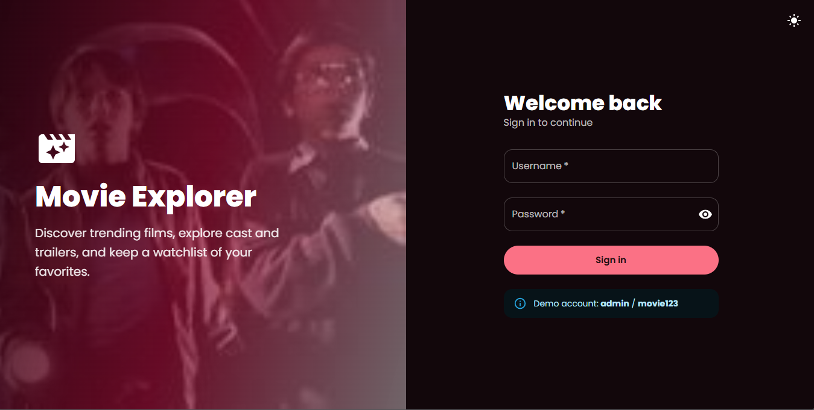
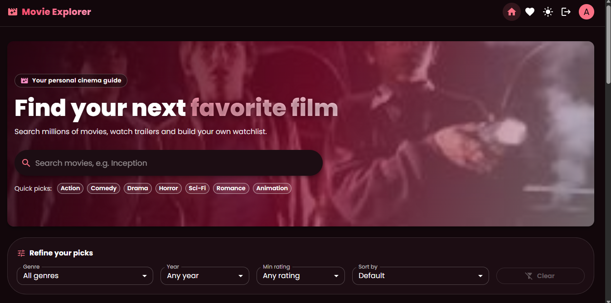
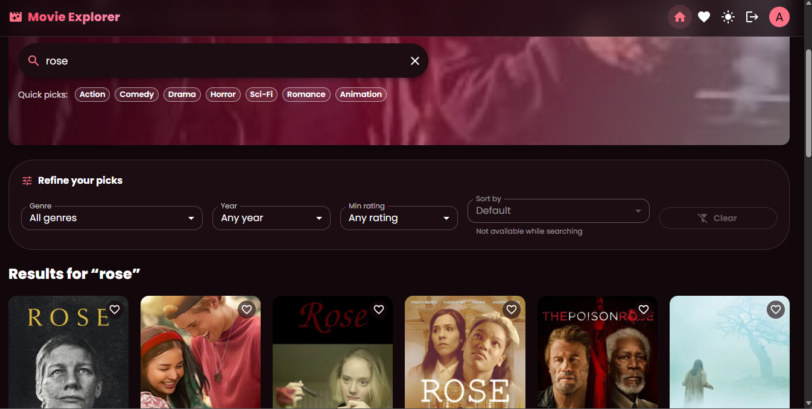
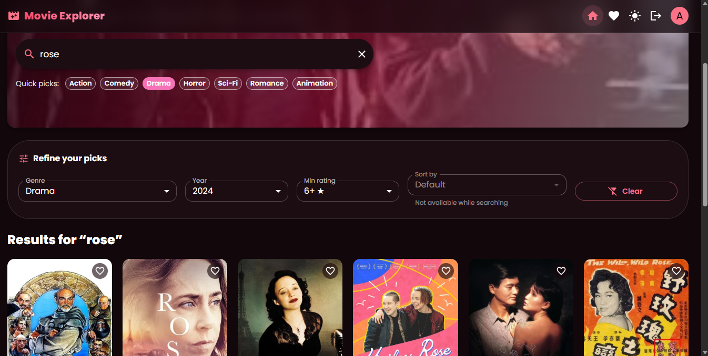
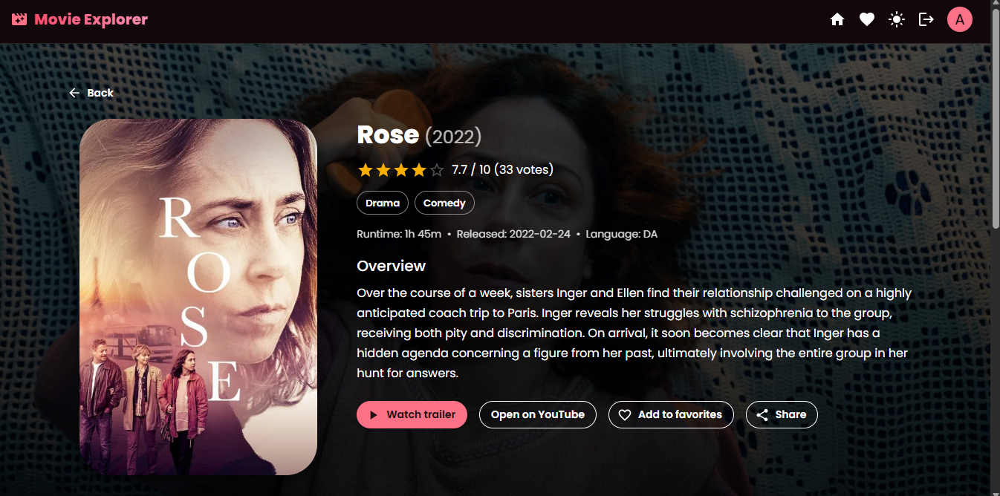
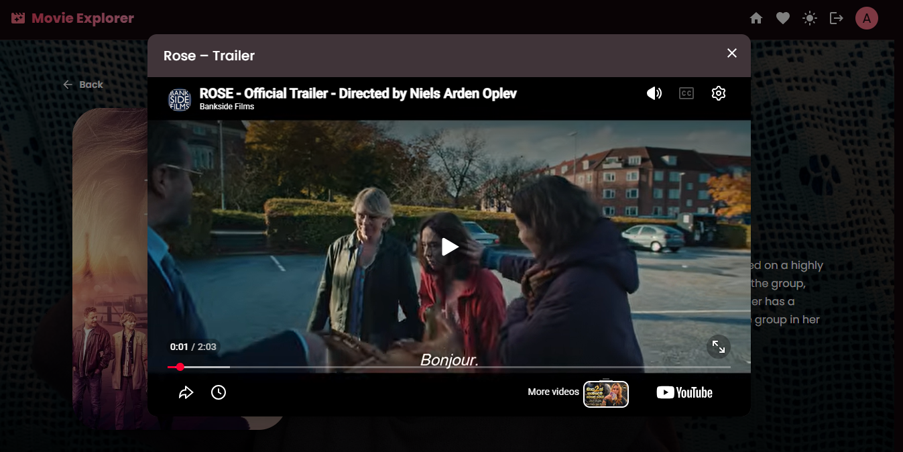
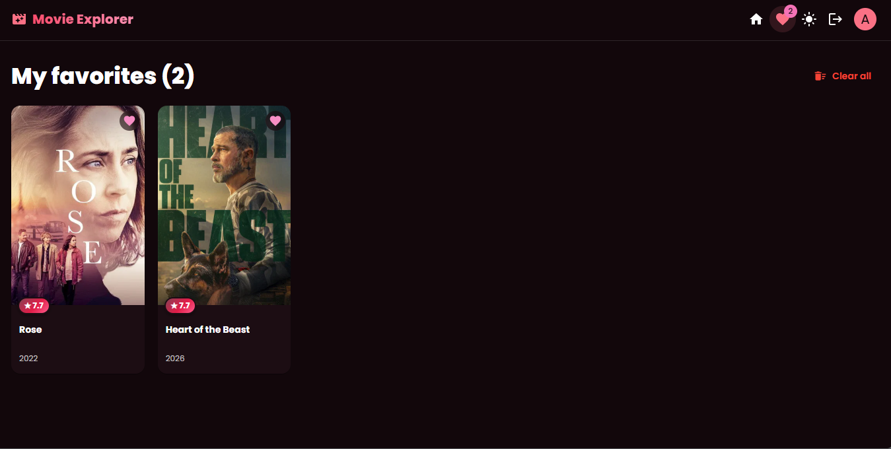
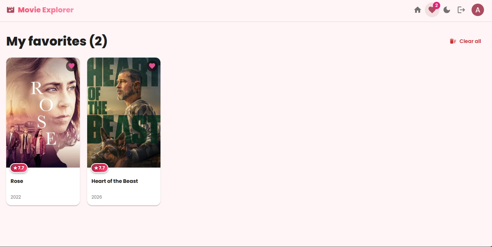
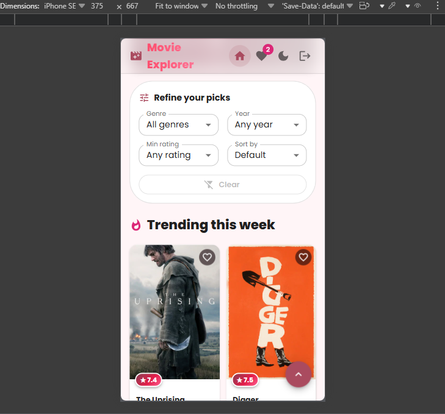

# Movie Explorer

A responsive movie discovery web app powered by [The Movie Database (TMDb)](https://www.themoviedb.org/) API. Search for films, browse what's trending, explore cast and trailers, and build a personal favorites list. Favorites, theme and last search are saved in the browser's `localStorage`, so no backend or database is required.

## Overview

The app has four main views:

- **Login** — a username and password sign-in screen. Every other page is protected and redirects here when you are signed out.
- **Home** — a hero search bar, quick genre chips, filters (genre, year, minimum rating, sort) and a grid of movie posters. It shows trending movies by default and switches to search results as you type.
- **Movie Details** — backdrop, poster, rating, genres, runtime, overview, top cast, an embedded YouTube trailer, share button and a "More like this" row.
- **Favorites** — every movie you have saved, with a "Clear all" action that asks for confirmation.

## Tech Stack

- React 18 
- Material-UI (MUI) v5 — all styling and components
- React Router v6
- Axios — API requests
- React Context API — state management
- localStorage — persistence 
- Jest and React Testing Library — tests

## Project Setup

### 1. Prerequisites

- Node.js 18 or newer and npm
- A free TMDb account and API key 

### 2. Clone and install

```bash
git clone https://github.com/HashiniPrabuddhika/movie-explorer.git
cd movie-explorer
npm install
```

### 3. Add your API key

Create a file named `.env.local` in the project root 

```
REACT_APP_TMDB_API_KEY=your_tmdb_v3_api_key
```

- Use the **API Key (v3 auth)**, not the long Read Access Token.
- No quotes and no spaces around `=`.
- The name must start with `REACT_APP_`, or Create React App will not expose it.
- Restart the dev server after creating or editing this file.
- `.env.local` is git-ignored. Copy `.env.example` as a starting point.

### 4. Run

```bash
npm start
```

The app runs at `http://localhost:3000`.

**Demo login:** `admin` / `movie123`

Other scripts:

```bash
npm test -- --watchAll=false   # run the tests once
npm run lint                   # run ESLint
npm run format                 # format code with Prettier
npm run build                  # production build
```

## API Usage

The app uses the [TMDb v3 API](https://developer.themoviedb.org/reference/intro/getting-started). All calls go through one Axios instance in `src/api/tmdb.js`.

### Getting an API key

1. Create an account at [themoviedb.org](https://www.themoviedb.org) and verify your email.
2. Open **Settings → API** and request a **Developer** key.
3. Copy the **API Key (v3 auth)** into `.env.local`.

### Endpoints used

| Feature | Endpoint | Notes |
|---|---|---|
| Trending movies | `GET /trending/movie/week` | Paginated, used with the **Load more** button |
| Search | `GET /search/movie` | Debounced, paginated, used with **infinite scroll** |
| Filter and sort | `GET /discover/movie` | Genre, year, minimum rating, sort order |
| Genre list | `GET /genre/movie/list` | Fills the genre dropdown |
| Movie details | `GET /movie/{id}?append_to_response=credits,videos` | Details, cast and trailer in a single request |
| Similar movies | `GET /movie/{id}/similar` | Powers "More like this" |
| Images | `https://image.tmdb.org/t/p/{size}/{path}` | Posters, backdrops and cast photos |

### How requests are handled

- **Interceptor:** a request interceptor adds `api_key` and `language=en-US` to every call.
- **Cancellation:** requests use `AbortController`, so a new search cancels the old one and no stale results appear.
- **Timeout:** requests time out after 10 seconds.
- **Friendly errors:** `getErrorMessage()` turns failures into plain messages, and every failed list shows a **Retry** button.

| Situation | Message shown |
|---|---|
| No connection | Network error. Please check your internet connection. |
| Timeout | The request timed out. Please try again. |
| 401 | We could not connect to the movie service. Please try again later. |
| 404 | We could not find what you were looking for. |
| 429 | Too many requests. Please wait a moment and try again. |
| 5xx | TMDb is having problems right now. Please try again later. |

- **Client-side filtering:** TMDb's search endpoint has no genre or rating filter, so those two filters are applied on the client while a search is active.

## Features Implemented

### Core requirements

- [x] Login page with username and password validation
- [x] Protected routes, redirecting to login when signed out
- [x] Search bar with debounce (500 ms) and a clear button
- [x] Poster grid showing title, release year and rating
- [x] Movie details page with overview, genres, cast, rating, runtime and trailer
- [x] Trending movies section on the home page
- [x] Light / dark mode toggle, saved to `localStorage`
- [x] TMDb integration for trending, search and movie details
- [x] Infinite scrolling for search results
- [x] Friendly error messages with Retry
- [x] State managed with the React Context API (Theme, Auth, Movie and Notification contexts)
- [x] Last searched movie saved to `localStorage` and shown as a "Last search" chip
- [x] Favorites saved to `localStorage`
- [x] React Router navigation: Home, Movie Details, Favorites
- [x] Reusable components and a mobile-first responsive layout

### Bonus features

- [x] Filter by genre, year and minimum rating
- [x] Quick genre chips for one-tap browsing
- [x] Sort by popularity, rating or release date
- [x] YouTube trailer in a dialog, plus an "Open on YouTube" link
- [x] "Load more" button for trending and filtered results
- [x] "More like this" recommendations

### Quality and polish

- [x] Skeleton loaders, empty states and snackbar notifications
- [x] Error boundary, so the user never sees a blank screen
- [x] Accessibility: skip link, ARIA labels, keyboard navigation, reduced motion support
- [x] Scroll-to-top button and per-page document titles
- [x] Unit tests, ESLint, Prettier 


## State Management

State is split into small, focused contexts:

 `ThemeContext` - Light / dark mode 
 `AuthContext`  - Signed-in user | 
 `MovieContext` - Favorites and last search  
 `NotifyContext`- Snackbar messages 

## Testing

```bash
npm test -- --watchAll=false
```

Tests cover the `MovieCard` (title, year, rating, favorite toggle), the `Login` form (validation and sign-in) and the app's route protection.

### Manual QA checklist

| Area | Checked |
|---|---|
| Login | Empty fields, wrong password, valid login, session survives refresh, logout |
| Route guard | `/favorites` redirects to login when signed out |
| Search | Debounce, clear button, infinite scroll, no-results state |
| Filters | Genre, year, rating and sort, with and without a search query |
| Details | Overview, genres, cast, trailer, no-trailer fallback, similar movies |
| Favorites | Add and remove, survives refresh, badge count, clear all |
| Persistence | Theme mode and last search survive a refresh |
| Errors | Offline mode and an invalid movie id show friendly messages |
| Responsive | 360 px, 768 px and 1280 px widths |
| Accessibility | Keyboard-only navigation and skip link |

## Screenshots


*Login page*


*Home page: hero search and trending movies*


*Search results with infinite scroll*


*Genre, year, rating and sort filters*


*Movie details with cast and "More like this"*


*YouTube trailer dialog*


*Favorites page*


*light mode*


*Responsive mobile layout*


## Notes on Data

Favorites, theme mode, the signed-in user and the last search live in `localStorage`. Clearing the browser's site data for this app resets them. Movie data is always fetched live from TMDb.

## Known Limitations

- **Demo login:** authentication is front-end only, using the fixed demo account above. There is no backend or real user database.
- **Search filters:** TMDb's search endpoint has no genre or rating filter, so those two are applied client side to the results already loaded.

## Live Deployment Link

```
https://your-app-name.netlify.app/
```
